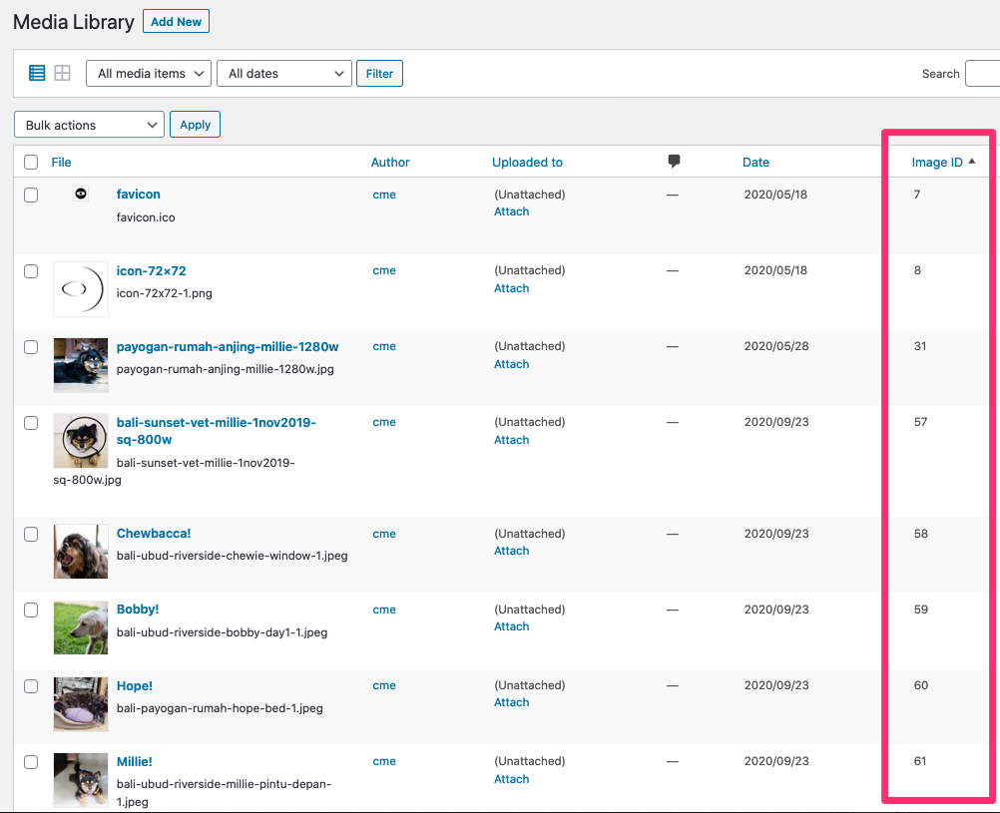

# caught my eye Sortable Image ID Column Plugin

This WordPres plugin creates custom column to display a sortable image ID column on the Media listing page.

---

## Installation

1. Manually upload the **contents** of the [zip](cme-image-id-column.zip) file of this repo to /wp-content/plugins/ directory or upload the zip via your wp-admin **Plugins** > **Add New** > **Upload Plugin**.
2. Activate the plugin through the wp-admin **Plugins** page.

That's it!

---

## Usage

1. Log in to your WordPress /wp-admin/ area.
2. Go to the Media Library.
3. Click on the _list_ view icon.
4. View Image ID column.
5. Click on the Image ID column heading to sort the rows.

---

## Screengrab

